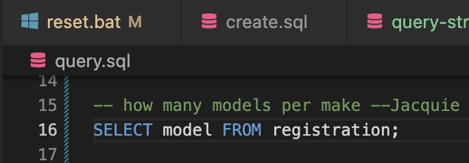

---
title: Vehicle Registrations Activity
subtitle: IT 120 - Databases
author:
- Kit Transue
...

# WA State Vehicle Registrations

Goal: to practice SELECT on a single table, using:

- naming columns to SELECT
- WHERE clause filtering
- ORDER BY
- DISTINCT
- summary functions (count, min, max)
- GROUP BY groupings

on a larger, real-world dataset.

## Activity

Most importantly: play!

- submit (at least) 4 queries/SELECTs
- answer (at least) 3 of the below questions
- ask one question for yourself (you can answer this or not)

Submit one or multiple .SQL files with comments (leading \-\- (double
hyphens)) to document the question.  List/call each of the query SQL
files in "query.bat". You are free to use whatever file organization
you want. Just remember I will be running the query.bat to see what
you've done.

{width=60%}

## Setup

The sample repository comes with two batch scripts (or their corresponding .sh):

- setup.bat (drops and recreates the database from the supplied .csv)
- query.bat (to automate running the queries you write)

Just run ".\setup.bat" (PowerShell) or "./setup.sh" (bash/zsh on macOS, Linux, WSL, etc.).
It should finish with "COPY 50000" indicating it brought in 50,000 rows.

## Questions

- what is the model oldest year represented in the database? newest?
- what makes are represented in the database?
- how many vehicles per make? what is the interesting order?
- number of Tesla vehicles by model?
- are all Ferraris red?
- are most Ferraris red?
- what proportion of registered vehicles are BEVs? (Get numbers to do the division; do not give final percentage.)
- how are BEVs distributed by county?

## Workflow

I suggest writing most queries using the VSCode editor window.

You can work interactively in a Terminal pane by running "psql -d vehicle50k" and entering
SQL there directly. I prefer to copy/paste from the editor window because the editor provides
a lot more support, and as you work there you can commit changes and track the queries
you've written. Everything you type in the lower psql prompt disappears quickly.


## Introductory notes

- this is a single table; it is not normalized

- **Check your capitalization of values!** Use a SELECT DISTINCT to take samples from the database. PostgreSQL downcases unquoted column and table names, but it does not alter value data. Values must match case.

- there is something strange about older cars--write some queries to explore

### Large dataset

Some hints on using <code>psql</code> when working with a large dataset:

- use LIMIT to make results smaller (especially in joins)
- DISTINCT is helpful in getting an idea of what values are used
- summary functions (max, min, count) are also helpful
- **use 'q' to quit the pager of long results and return to the psql command prompt**

## About the dataset(s)


https://data.wa.gov/Transportation/Vehicle-Registration-Transactions-by-Department-of/brw6-jymh

20M records; 5GB, covering the years are 2020-2022, inclusive.

Each row represents someone registering their vehicle for that
date. Registrations usually last one year, so it may be that a vehicle
is represented three times (or more?)  in the full dataset. For the
smaller datasets, they represent only one week or month, so the vehicles are
probably unique.

### Smaller

There are two smaller datasets. They are faster to experiment with,
and because they do not cover multiple years, the vehicles in the
database are probably unique.

The smaller versions do not have a CSV header:

- vrt50k.csv: 11MB; 50,000 records
- vrt_2022-12.csv: 95MB, 397k records

Available from Canvas.

vrt_2022-12.csv has all/only registrations from December, 2022.

vrt50k.csv has the first 50,000 records from December, 2022.


### Schema

Create the database table:

```sql
CREATE TABLE registration (
    TransactionDate DATE,
    Make VARCHAR,
    Model VARCHAR,
    MYear INTEGER,
    Color VARCHAR,
    Type VARCHAR,
    Use VARCHAR,
    FuelTypePrimary VARCHAR,
    GVWRClass VARCHAR,
    GVWRRange VARCHAR,
    FuelTypeSecondary VARCHAR,
    Electrification VARCHAR,
    PlateBackground VARCHAR,
    PlateConfiguration VARCHAR,
    OwnerType VARCHAR,
    County VARCHAR,
    State VARCHAR,
    PostalCode VARCHAR,
    TransactionType VARCHAR,
    TransactionChannel VARCHAR,
    PaymentType VARCHAR,
    CensusTract VARCHAR,
    TransactionCount VARCHAR
);
```

### Importing full dataset

For playing with queries, please skip ahead to "Importing smaller datasets."

The full dataset is big, but the database handles it OK with indexes.
(It takes about 5 minutes to load from a fast SSD; similar time to index.)

For full dataset (has a header):

```
SET datestyle TO 'ISO, MDY';
\COPY registration FROM '/Users/kit/Downloads/Vehicle_Registration_Transactions_by_Department_of_Licensing.csv' CSV HEADER
```

Queries are much faster if you index the interesting columns:

```
CREATE INDEX ON registration(make);
CREATE INDEX ON registration(model);
CREATE INDEX ON registration(transactiondate);
CREATE INDEX ON registration(electrification);
```

(The indexes are only needed if you have the full database.)


### Importing smaller datasets


Starting with the table you created from the description above:

- download your desired .csv file from Canvas
- move the downloaded file into your project directory (it is easier to copy without paths)
- \\COPY the data (use the backslash!) into your table


```
SET datestyle TO 'ISO, MDY';
\COPY registration FROM 'vrt_2022-12.csv' CSV;
```

or

```
SET datestyle TO 'ISO, MDY';
\COPY registration FROM 'vrt50k.csv' CSV;
```


## Example query

```
SELECT DISTINCT make, model FROM registration ORDER BY model DESC LIMIT 10 ;
```

```
SELECT myear, count(myear) FROM registration WHERE myear < 1990 GROUP BY myear ORDER BY myear ;
```


## Extras

Some county-level questions are more interesting if you know the population
of the county, which can vary widely.

I have not found a county-level population on data.wa.gov, but there are some tables here:

https://ofm.wa.gov/washington-data-research/population-demographics/population-estimates/historical-estimates-april-1-population-and-housing-state-counties-and-cities

They are in Excel format on a separate worksheet and have the common
1NF violation of having a different column for each year. But they could
be adapted and loaded into this database if anyone is interested in trying out JOINs.